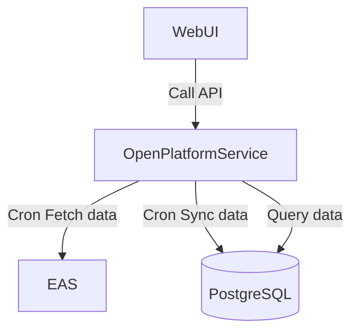

# Open Platform

## Description

[Nest](https://github.com/nestjs/nest) framework TypeScript starter repository.

## Flowchart



## Synchronize EAS data to PostgreSQL

```text
Optimism-Sepolia:
https://optimism-sepolia.easscan.org/schema/view/{schemaId}

```

### Claim Schema

`schemaId: 0x957c1ce9579ea03fcd9e08f0ef9d0ef4ba3ca67f7b459655bcf87a060fd772ca`

- address ProjectAddress
- bytes32 ContributionID
- string Detail
- string Type
- string Proof
- uint256 StartDate
- uint256 EndDate
- uint256 TokenAmount
- string Extended

### Vote Schema

`schemaId: 0x6e4068d80a37bc2fb9223e2f07b909b98b370d76b1d94cd83c1a64bb6006a9e5`

- address ProjectAddress
- bytes32 ContributionID
- uint8 VoteChoice
- string Comment

### Contribution Schema

`schemaId: 0xa429ad803ae12a0fcb9c0c130673a4c7357da08e1407b62bce5cfe358d673526`

- [x] address ProjectAddress
- [x] bytes32 ContributionID
- [x] string Detail
- [x] string Type
- [x] string Proof
- [x] uint256 StartDate
- [x] uint256 EndDate
- [x] uint256 TokenAmount
- string Extended => 对应db哪些字段 ?

```sql
CREATE TABLE public."Contribution" (
	detail text NOT NULL, => Detail
	proof text NOT NULL, => Proof
	credit float8 NOT NULL, => TokenAmount
	"toIds" _text NULL,
	status public."Status" DEFAULT 'UNREADY'::"Status" NOT NULL,
	"ownerId" text NOT NULL,
	"projectId" text NOT NULL, => ProjectAddress
	"createAt" timestamp(3) DEFAULT CURRENT_TIMESTAMP NOT NULL, => 根据db写入时间控制
	"updatedAt" timestamp(3) NOT NULL, => 根据db写入时间控制
	deleted bool DEFAULT false NOT NULL,
	"uId" text NULL, => AttestationUID
	id text NOT NULL, => ContributionID
	"contributionDate" text NULL, => {"startDate":"","endDate":""}
	"type" _text NULL, => Type
	"endDate" timestamp(3) NULL, => EndDate (和 contributionDate 用哪个？)
	"startDate" timestamp(3) NULL, => StartDate (和 contributionDate 用哪个？)
	"imageList" _text NULL => 好像在Proof里面？ Proof = <p>1</p> <<imageList>> []
);
```

db表的数据其实是比eas多一点，

frontend -> backend -> eas -> DB (同步)

后端肯定是写eas + db成功率高

- 写eas失败，直接报错
- 写eas成功，写DB成功
- 写eas成功，写DB失败 （同步机制）

Step:
(定时任务每天跑一次更新全量遍历) + （定时任务 每10分钟跑一次，只拿最近15分钟的uid 可选）

1. 在EAS中根据每个Schema ID 查询到所有的AttestationUID (已经有唯一索引)
2. 对于每条AttestationUID，如果不存在，直接写入
3. 对于每条AttestationUID，如果存在，进行一次对比，查看是否需要覆盖写，

- 这里可以SynStatus状态可以多加一个？比如INIT 状态表示已经同步好，后续不需要重复对比，数据量大的时候可以加

status = UNREADY || READY || CLAIM

```


select * from "Contribution" c where "uId" = '0x22b17c6cc229abdd192739b105892a62981897c6fe1e96082287e9bec7e00dc7' or "uId" = '0x1580b7e2e36d327b3e907e66293a00f218d070daf367192b952d5049d19e85b5'
```

## Swagger

```shell
curl 0.0.0.0:33000/api
```
